# jbnu-wp-solo

2019년. 2학년 1학기. Windows Programming. 윈도우즈프로그래밍.

## 1. Development

### 1-1. Summary

C# 기반의 ***Hello World*** 및 ***계산기*** 윈도우 애플리케이션 개발.

1. `WpfApp1`: ***Hello World***
2. `LuMir_Calculator`: ***계산기***

### 1-2. Environment

C#, Visual Studio

### 1-3. Detailed

#### 1-3-1. `WpfApp1`: ***Hello World***

임의의 버튼을 하나 만들고, 버튼을 눌러 `Hello!` 출력하기.

#### 1-3-2. `LuMir_Calculator`: ***계산기***

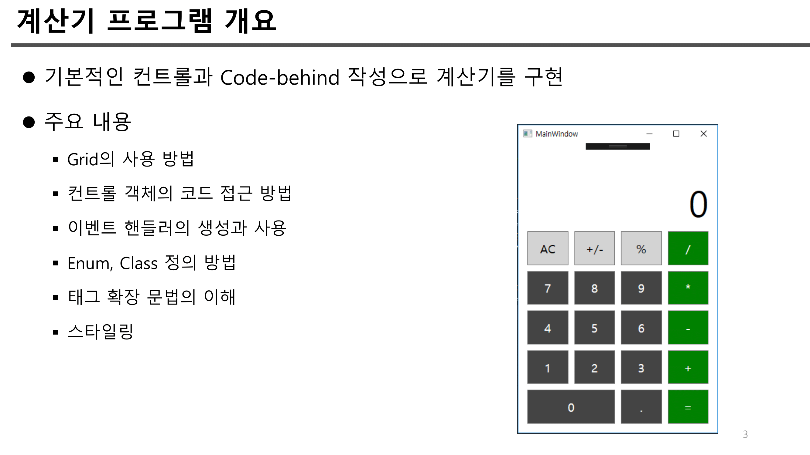
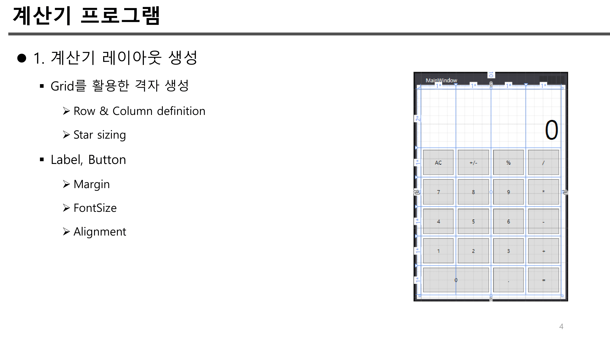
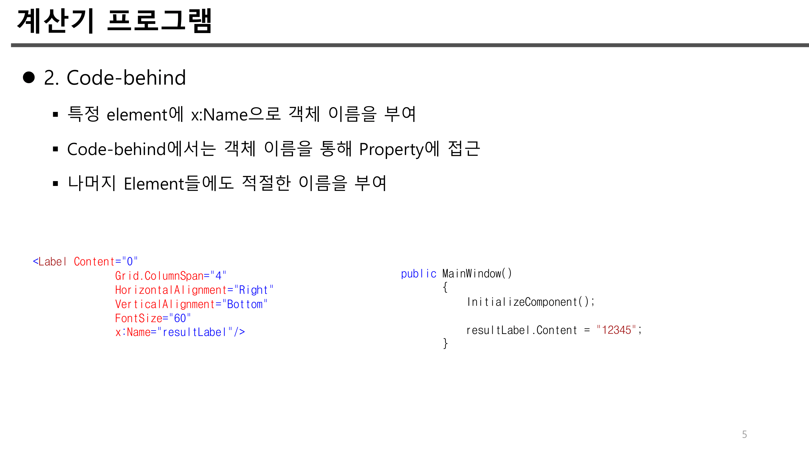
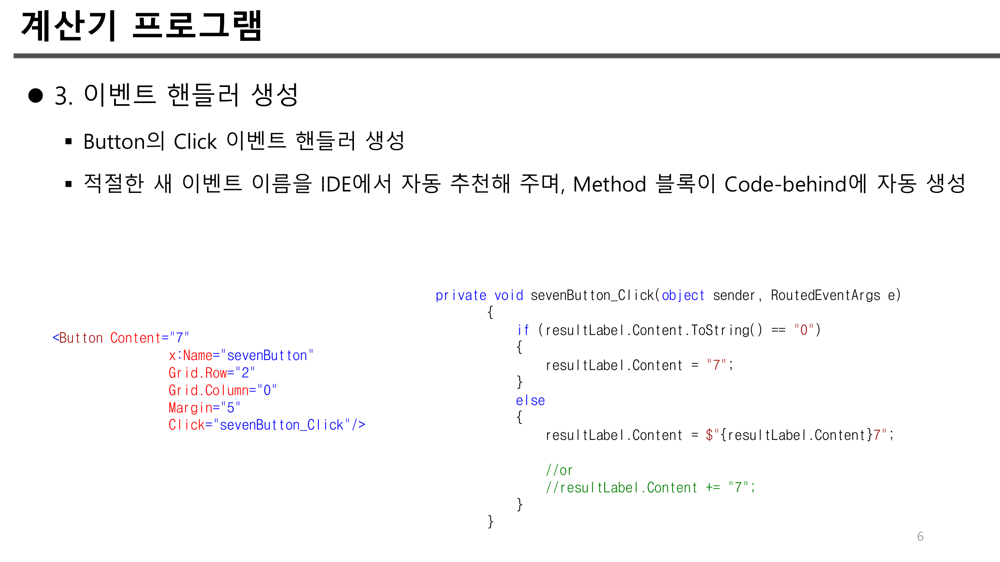
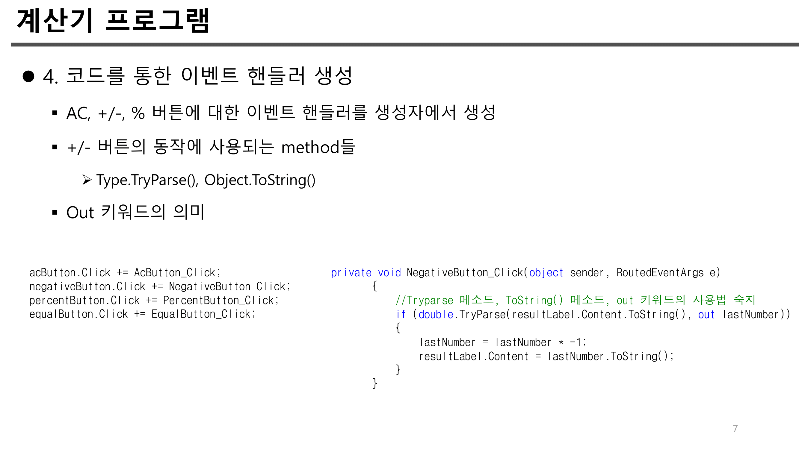
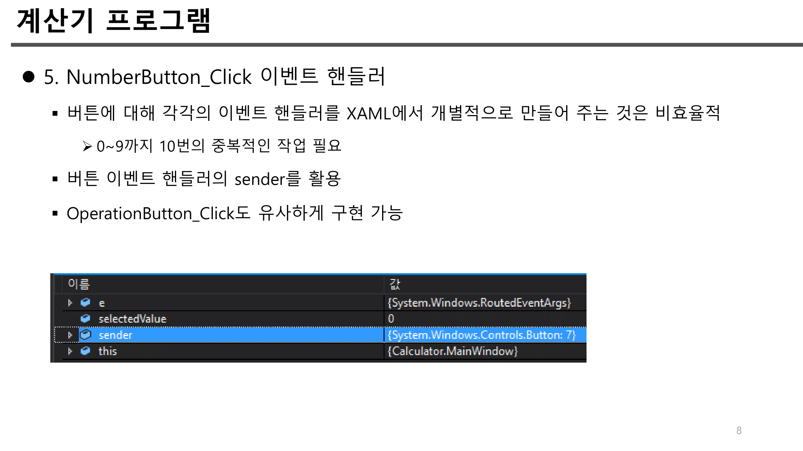
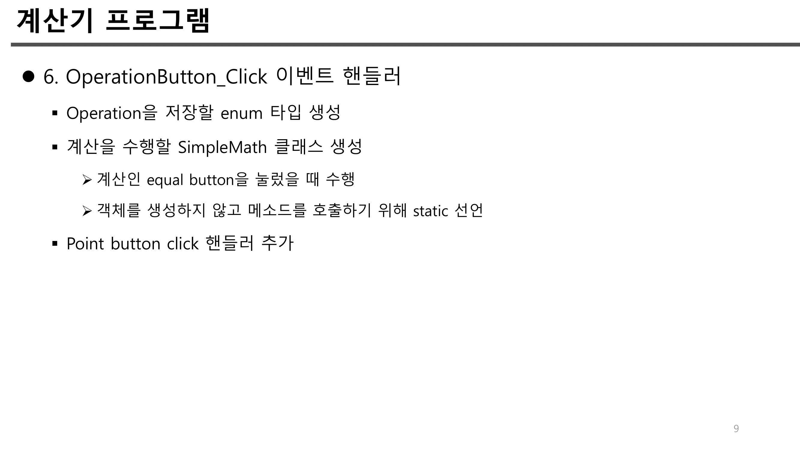
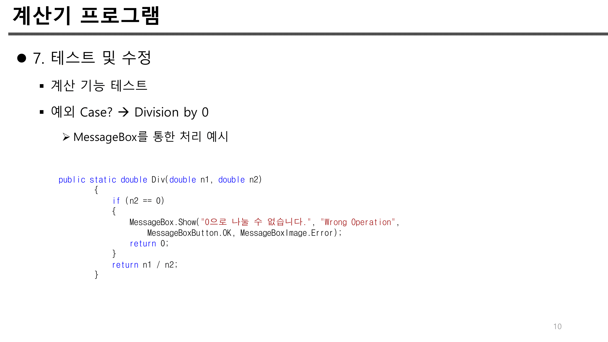

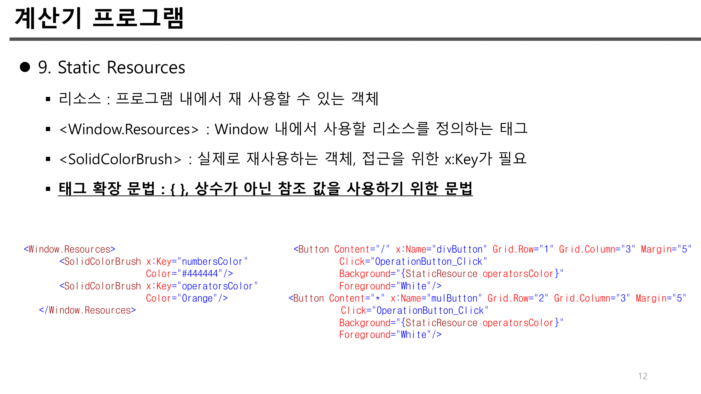
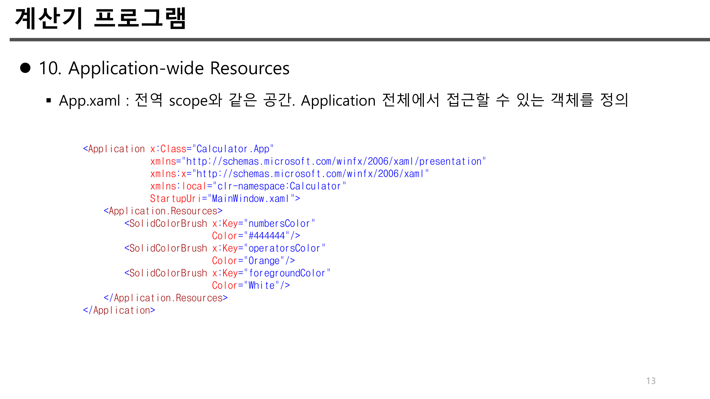
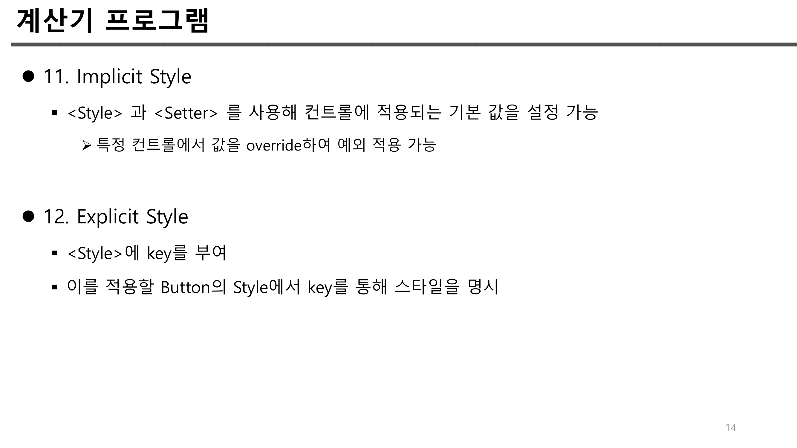
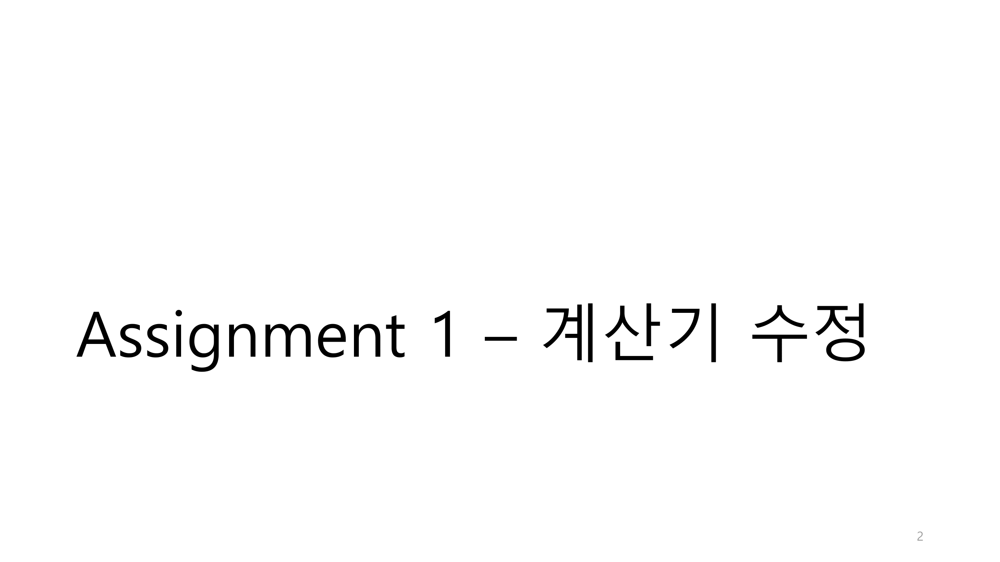
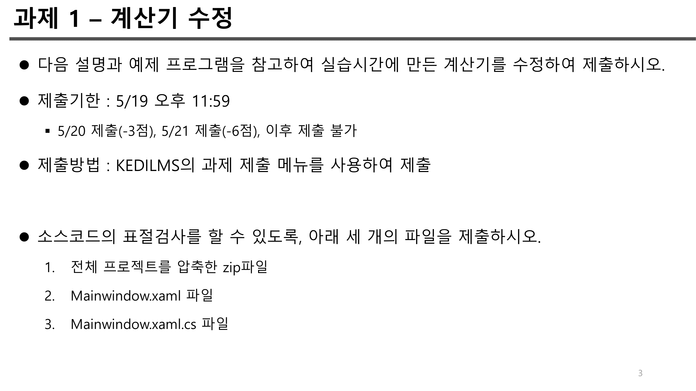
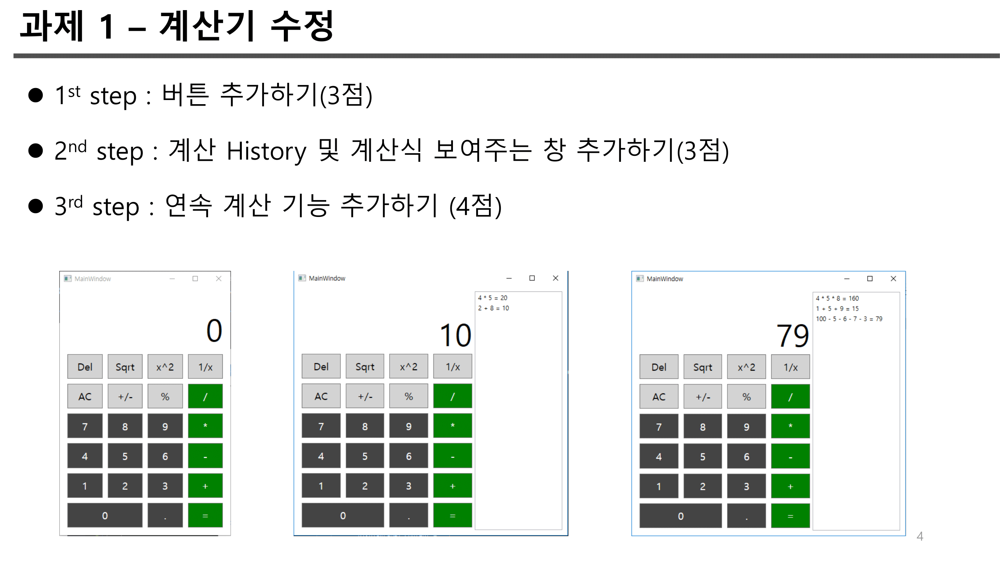
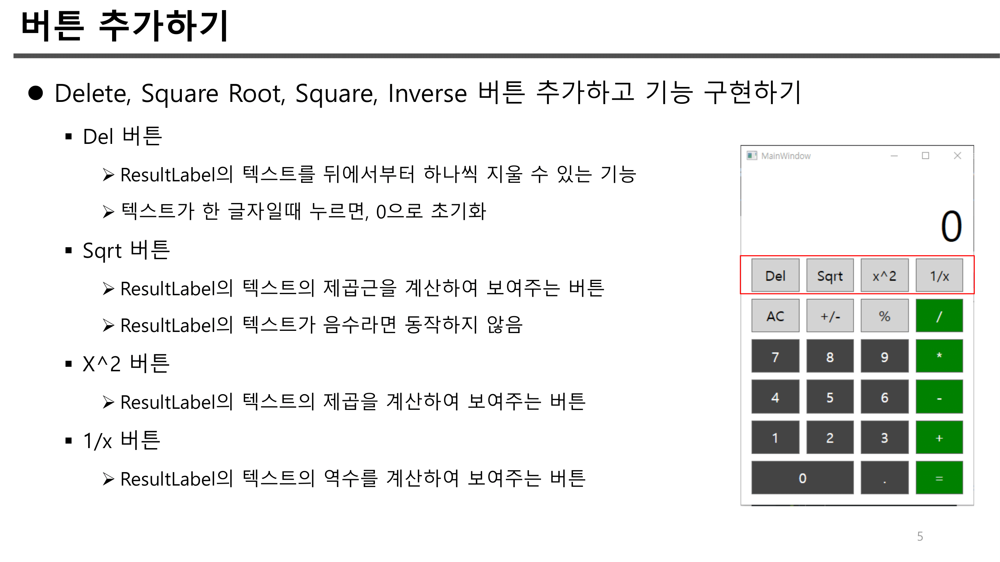
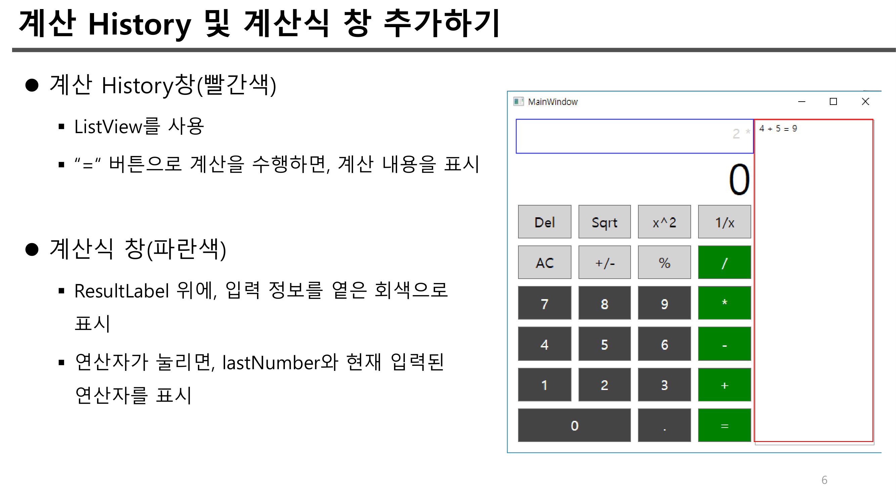
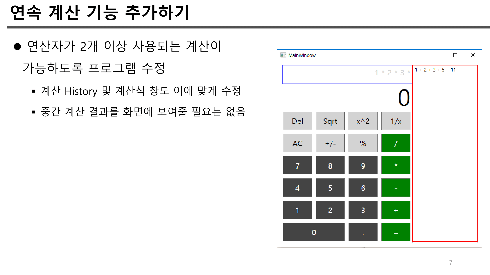